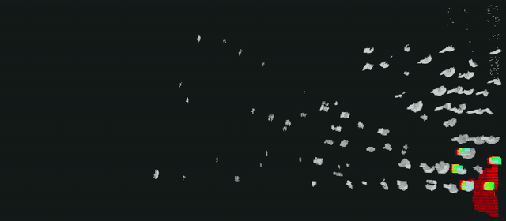
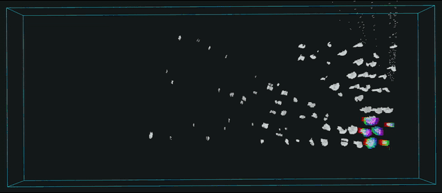
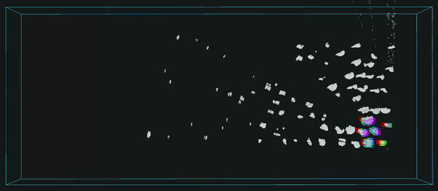

# UAV Autonomy All-in-One

基于 ROS1 Noetic、PX4 和 Gazebo Classic 的无人机自主飞行框架，统一仿真与真机的定位、规划、任务和控制接口。规划器在启动时选择，当前支持：

- `diff`：Diff-Planner；
- `fast-kino`：Fast-Planner Kinodynamic；
- `fast-topo`：Fast-Planner Topological；
- `super`：SUPER Safety-assured local planner。

```text
仿真：PX4 SITL + Gazebo + 模拟 MID-360
真机：PX4 + MID-360 + FAST-LIO

odom/cloud ──────────────────────────→ selected planner
/goal → planner gateway ─────────────→ selected planner
                 ▲                           │
                 └──── status / command ─────┘
                 │
                 └→ /command/trajectory → SE3 → MAVROS → PX4
```

## 仿真效果

<p align="center">
  
</p>

以下 GIF 均为原录像的 4 倍速。

| Diff-Planner | Fast Kino |
|---|---|
|  |  |

| Fast Topo | SUPER |
|---|---|
|  |  |

## 环境

仿真宿主机和真机 Jetson 需要 Docker 与 tmux；真机地面站需要 Docker 和可用的桌面
图形会话。项目镜像提供 Gazebo、RViz、PX4、ROS 与规划器运行环境。以下命令均在对应
电脑的仓库根目录执行。

## 仿真

`start` 和 `restart` 必须同时指定场景与规划器。内置场景为 `room`、`forest`。

```bash
# 构建改动并启动 forest + Diff；飞机保持未解锁
./launch/sim.sh --scene forest --planner diff start

# PX4 原生起飞到相对 Home 1.5 m，稳定后进入 OFFBOARD
SIM_TAKEOFF_HEIGHT=1.5 ./launch/sim.sh arm

# 发送 world 目标；最后一个参数是可选的终点 yaw（度）
./launch/sim.sh goal 1.0 0.0 1.5
./launch/sim.sh goal 1.0 1.0 1.5 90

# 自动降落并停止仿真
./launch/sim.sh land
./launch/sim.sh stop
```

切换规划器或场景时使用 `restart`：

```bash
./launch/sim.sh --scene forest --planner fast-kino restart
./launch/sim.sh --scene forest --planner fast-topo restart
./launch/sim.sh --scene forest --planner super restart
```

仿真栈运行时可执行 Mission。起飞前会检查全部航点；rolling-map 规划器无法提前判断
的远端局部地图范围只在此阶段暂缓，并在每个航点发布前重新验证：

```bash
./launch/sim.sh mission mission_indoor.json
./launch/sim.sh mission mission_forest.json
```

场景、RViz、日志和排错见[仿真运行指南](docs/simulation.md)。

## 真机

真机配置、部署、飞前检查与飞行操作统一见[真机部署指南](docs/deployment.md)。
机载 Jetson 使用 `real_container.sh` 和 `real.sh`；地面站使用独立的轻量
`ground_station_container.sh` 和 `real_rviz.sh`，两端不共用运行容器。

## 目录

| 目录 | 内容 |
|---|---|
| `common/` | 公共飞行命令、Mission、定位保护与 SE3 入口 |
| `planning/` | 插件管理、公共规划消息、adapter 和隔离 workspace |
| `simulation/` | PX4/Gazebo 仿真、场景和仿真适配 |
| `deployment/` | Jetson 真机镜像、轻量地面站镜像、Livox/FAST-LIO 适配与配置 |
| `launch/` | 宿主机入口脚本 |
| `third_party/` | 固定版本的上游源码 |
| `runtime/` | 构建结果、日志和 rosbag |

## 日志

| 内容 | 路径 |
|---|---|
| 仿真运行日志 | `runtime/simulation/runs/<run-id>/` |
| 仿真 rosbag | `runtime/simulation/flight_bags/` |
| 真机 rosbag 与容器 ROS 日志 | `runtime/flight_bags/` |
| 真机宿主日志 | `~/uav-autonomy-aio_logs/<run-id>/` |

每次运行的 rosbag 默认使用 LZ4、1 GiB 分卷，`--max-splits=10` 为轮换值；切分时
可能多保留一个文件，因此不能把 10 GiB 当作严格空间上限。历史运行不会自动删除。

## 文档

| 文档 | 内容 |
|---|---|
| [仿真运行指南](docs/simulation.md) | 场景、飞行命令、RViz、日志和排错 |
| [真机部署指南](docs/deployment.md) | Jetson、传感器、PX4 与飞行流程 |
| [公共自主飞行接口](common/README.md) | 定位契约、公共话题和安全语义 |
| [多规划器插件框架](planning/README.md) | 规划器选择、调参、插件接口和扩展方法 |
| [SE3 控制器](docs/se3_controller.md) | 控制原理、标定、调参与排障 |

## 致谢

本项目基于并集成了以下开源项目，感谢其作者和维护者：

- 规划与控制：[EGO-Planner-v2](https://github.com/ZJU-FAST-Lab/EGO-Planner-v2)、
  [Fast-Planner](https://github.com/HKUST-Aerial-Robotics/Fast-Planner)、
  [SUPER](https://github.com/hku-mars/SUPER)、
  [Diff-Planner](https://github.com/DifferentialRobotics/Diff-Planner)、
  [Diff-Planner-PX4](https://github.com/Tfly6/Diff-Planner-PX4) 和
  [SE3 Controller](https://github.com/HITSZ-MAS/se3_controller)；
- 飞控与仿真：[PX4-Autopilot](https://github.com/PX4/PX4-Autopilot)、
  [Gazebo Classic](https://github.com/gazebosim/gazebo-classic)、
  [MAVROS](https://github.com/mavlink/mavros) 和 [ROS](https://www.ros.org/)；
- 定位与传感器：[FAST-LIO](https://github.com/hku-mars/FAST_LIO)、
  [Livox ROS Driver 2](https://github.com/Livox-SDK/livox_ros_driver2) 和
  [Mid360 PX4 Simulation Plugin](https://github.com/Tfly6/Mid360_px4_sim_plugin)。

各上游项目的版权与许可证归其原作者所有；使用和分发时请遵守对应许可证。
