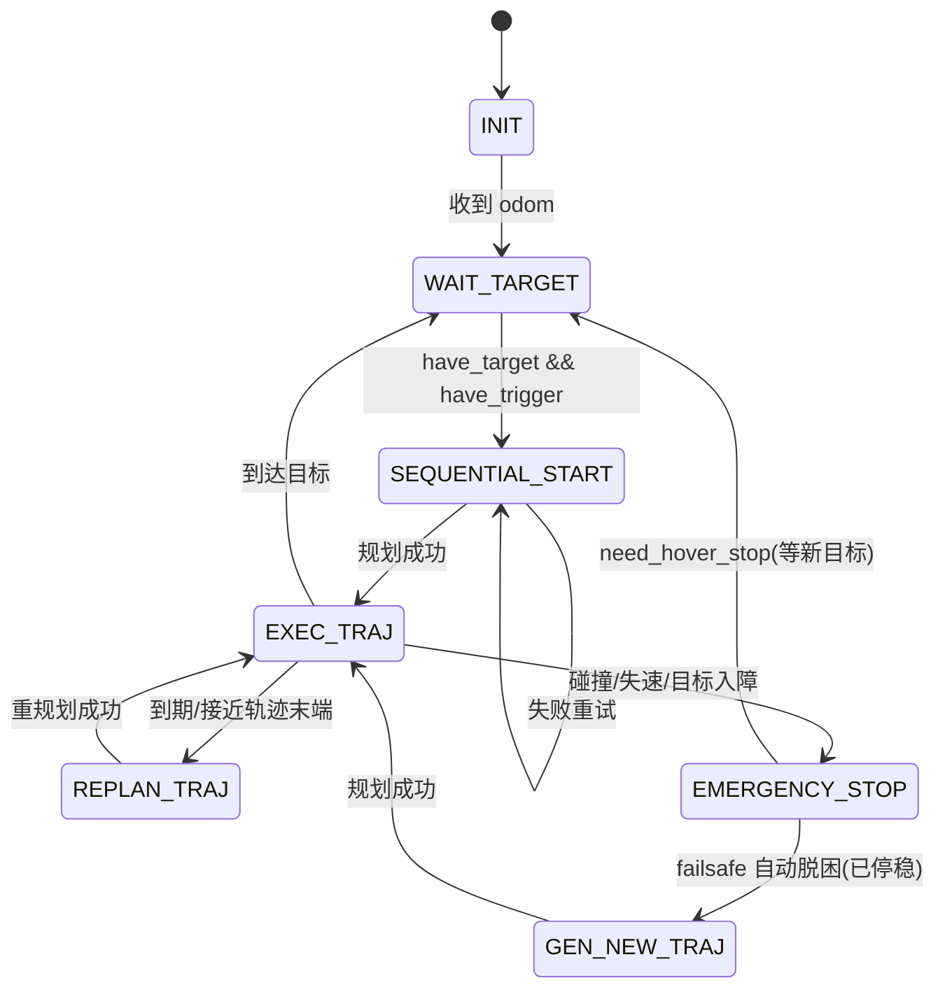

# Diff-Planner 规划器工作原理详解

> 本文面向想真正理解本项目所用局部规划器 **Diff-Planner** 算法原理的读者，覆盖从感知建图、前端搜索、轨迹表示、后端优化，到状态机编排、轨迹执行、多机协同以及与 PX4 真机链路对接的完整链路。既给直觉解释，也给数学推导与源码定位。
>
> 所有源码路径相对仓库根 `third_party/Diff-Planner-PX4/src/diff_planner/`（个别给出绝对路径）。引用形如 `文件:行号` 方便跳转核对。文末「实现瑕疵」一节如实列出代码中的可疑点与遗留代码，阅读源码时请留意。

---

## 先读导引

这 4 篇文档建议按「规划器生成轨迹 → 控制器跟踪轨迹 → 高度积分调参 → 自主跟踪排障」来读：

| 顺序 | 文档 | 解决的问题 |
|---|---|---|
| 1 | 本文 | Diff-Planner 如何把点云/里程计/目标点变成可执行多项式轨迹 |
| 2 | [se3_controller.md](se3_controller.md) | SE3 控制器如何把轨迹点变成 PX4 的姿态 + 油门 |
| 3 | [ki_pz_tuning_guide.md](ki_pz_tuning_guide.md) | 悬停慢慢掉高时，如何整定竖直积分项 |
| 4 | [trajectory_tracking_altitude.md](trajectory_tracking_altitude.md) | 接入规划器后仍掉高时，如何区分推力、里程计、跟踪滞后问题 |

如果你是第一次读，先抓住这条主线：

```text
FAST-LIO 点云/里程计
  → GridMap 建局部占据地图
  → A* 只在轨迹穿障时提供绕障方向
  → MINCO + L-BFGS 优化出平滑局部轨迹
  → traj_server 100 Hz 采样成 PositionCommand
  → converter 透传 P/V/A/yaw
  → SE3 控制器生成姿态 + 油门
```

本文内容很多，可以分三轮读：

| 目标 | 建议阅读 |
|---|---|
| 先建立整体图 | §1、§2、§3、§13 |
| 查真机部署参数 | §11、§12、§14 |
| 深入算法细节 | §4–§8，再按需要看 §9–§10 |

记住三个关键词就不会迷路：**ring-buffer 地图负责“哪里能走”**，**A* 负责“从哪边绕”**，**MINCO/L-BFGS 负责“轨迹怎么又平滑又可行”**。

---

## 目录

1. [概述与定位](#1-概述与定位)
2. [设计哲学：ESDF-free + MINCO + 滚动重规划](#2-设计哲学esdf-free--minco--滚动重规划)
3. [整体架构与数据流](#3-整体架构与数据流)
4. [环境表示：占据栅格地图（plan_env）](#4-环境表示占据栅格地图plan_env)
5. [前端：动态 A\* 路径搜索（path_searching）](#5-前端动态-a-路径搜索path_searching)
6. [轨迹表示：MINCO / 分段多项式（traj_opt）](#6-轨迹表示minco--分段多项式traj_opt)
7. [后端：轨迹优化（poly_traj_optimizer + L-BFGS）](#7-后端轨迹优化poly_traj_optimizer--l-bfgs)
8. [规划状态机：DiffReplanFSM（plan_manage）](#8-规划状态机diffreplanfsmplan_manage)
9. [轨迹执行：traj_server 与数据结构](#9-轨迹执行traj_server-与数据结构)
10. [多机协同与互检测（swarm_bridge / drone_detect）](#10-多机协同与互检测swarm_bridge--drone_detect)
11. [与 PX4 真机链路的对接](#11-与-px4-真机链路的对接)
12. [关键参数详解（真机实测值）](#12-关键参数详解真机实测值)
13. [端到端走查：从点目标到电机指令](#13-端到端走查从点目标到电机指令)
14. [实现瑕疵与注意事项](#14-实现瑕疵与注意事项)
15. [术语表与参考](#15-术语表与参考)

---

## 1. 概述与定位

**Diff-Planner** 是微分智飞（Differential Robotics）为其教育无人机子品牌「非凸空间」适配的单机导航避障规划器。它**基于浙江大学 FAST-Lab 开源的 [EGO-Planner-v2](https://github.com/ZJU-FAST-Lab/EGO-Planner-v2)**，由原班人马深度参与优化，并在本仓库进一步**适配到 PX4 / ROS1 真机环境**。

源流链条：

```text
EGO-Planner / EGO-Planner-v2 (ZJU FAST-Lab)
        │  继承「ESDF-free 梯度避障 + MINCO 轨迹优化」框架
        ▼
Diff-Planner (微分智飞，针对教育平台增强：失速检测、目标修正、虚拟墙等)
        │  适配 PX4 SITL / MAVROS
        ▼
Diff-Planner-PX4 (本仓库，真机部署：MID360 + FAST-LIO + SE3 控制器)
```

在本项目的真机链路里，Diff-Planner 处于**感知**与**控制**之间：

```text
MID-360 LiDAR → FAST-LIO → /Odometry_base + /cloud_registered
                                   │
                                   ▼
                            Diff-Planner（建图 + 规划）
                                   │  /drone_0_planning/trajectory
                                   ▼
                              traj_server（轨迹采样）
                                   │  /drone_0_planning/pos_cmd
                                   ▼
              trajectory_msg_converter.py → SE3 控制器 → MAVROS → PX4
```

Diff-Planner 的职责：**在一张随机体滑动的局部占据栅格地图上，把「当前状态 → 目标点」实时求解成一条平滑、无碰撞、满足动力学约束的多项式轨迹，并以 100 Hz 滚动重规划。**

源码按 ROS 功能包组织：

| 功能包 | 职责 | 核心文件 |
|---|---|---|
| `plan_env` | 占据栅格地图（环境表征） | `grid_map.{h,cpp}`、`raycast.{h,cpp}` |
| `path_searching` | 前端栅格 A* 搜索 | `dyn_a_star.{h,cpp}` |
| `traj_opt` | MINCO 轨迹表示 + 后端优化 | `poly_traj_utils.hpp`、`poly_traj_optimizer.{h,cpp}`、`lbfgs.hpp`、`root_finder.hpp` |
| `plan_manage` | 状态机编排 + 轨迹服务 | `diff_replan_fsm.{h,cpp}`、`planner_manager.{h,cpp}`、`traj_server.cpp` |
| `traj_utils` | 数据结构、消息、可视化 | `plan_container.hpp`、`planning_visualization.{h,cpp}`、`msg/*.msg` |
| `swarm_bridge` | 多机轨迹网络广播 | `bridge_node_{udp,tcp}.cpp`、`reliable_bridge.hpp` |
| `drone_detect` | 从深度图剔除队友机体 | `drone_detector.{cpp,h}` |

> 多机相关的 `swarm_bridge` / `drone_detect` 在**本仓库单机真机部署中并不启动**（详见 [§10](#10-多机协同与互检测swarm_bridge--drone_detect)）。

---

## 2. 设计哲学：ESDF-free + MINCO + 滚动重规划

Diff-Planner 的三块基石，决定了它「为什么快、为什么能在机载算力上实时运行」。

### 2.1 ESDF-free 的梯度避障

传统梯度规划器（如 Fast-Planner）需要维护一张**欧氏符号距离场（ESDF）**，在每个体素上存「到最近障碍的距离及其梯度」，优化时直接查询距离梯度把轨迹推离障碍。ESDF 的构建与维护开销很大。

EGO 系列（含 Diff-Planner）**完全不维护 ESDF**。本仓库代码经核实：

- 地图层 `GridMap` 只暴露 `getOccupancy`（原始占据 0/1）和 `getInflateOccupancy`（膨胀占据计数），**没有任何 `getDistance` / `getDistWithGrad` 接口**（`grid_map.h:145-148`）。
- 维护的数据只有 `occupancy_buffer_`（log-odds 概率）和 `occupancy_buffer_inflate_`（膨胀计数），**没有距离场**（`grid_map.h:97-98`）。

那么没有距离场，怎么得到「把轨迹往哪推」的梯度？答案是**用前端 A\* 的几何路径，为每个碰撞控制点生成一对 `{base_point p, direction v}`**：`p` 是安全侧的障碍边界点，`v` 是归一化的排斥方向（指向 A* 选择绕行的那一侧）。优化时把「点到障碍的有符号距离」近似为沿 `v` 的投影 `d = (轨迹点 - p)·v`，距离不足就沿 `-v` 加排斥梯度。这套 `{p,v}` 机制是 EGO-Planner 的标志性做法（详见 [§7.3](#73-esdf-free-碰撞梯度ego-标志性做法)）。

### 2.2 MINCO 轨迹参数化

后端不直接优化几十个多项式系数，而是用 **MINCO（Minimum Control，本仓库用 minimum-jerk）** 把轨迹参数化为「**中间路点 `q` + 各段时间 `T`**」这一组最小参数。给定 `{q, T}`，通过一个带状线性系统就能**唯一确定**最小 jerk 多项式的全部系数。这样：

- 优化变量维度大幅降低（只有路点和时间）；
- 「对系数的梯度」可以通过链式法则（解伴随系统）**解析地**反传到「对路点和时间的梯度」；
- 带状系统用 O(N) 的无主元 LU 求解，效率远高于一般 QP。

详见 [§6](#6-轨迹表示minco--分段多项式traj_opt)。

### 2.3 高频滚动重规划

机载局部地图只能看到周围几米，规划器并不一次性算到终点，而是：

- 在全局参考轨迹上选一个 `planning_horizon`（真机 3 m）之外的**局部目标**；
- 反复求解「当前状态 → 局部目标」的短程轨迹；
- 由 **100 Hz 的状态机定时器** 判断是否需要重规划，**20 Hz 的安全定时器**实时扫描碰撞，发现危险立即重规划或急停。

这种「短视距 + 高频刷新」的滚动时域（receding-horizon）方式，让规划器对动态变化和地图更新有很强的鲁棒性。

---

## 3. 整体架构与数据流

```mermaid
flowchart TB
    subgraph 感知["感知 (外部, FAST-LIO)"]
        ODOM["/Odometry_base 里程计"]
        CLOUD["/cloud_registered 世界系点云"]
    end

    subgraph planner["diff_planner_node (单进程, 单线程 ros::spin)"]
        MAP["GridMap 占据栅格地图<br/>plan_env"]
        FSM["DiffReplanFSM 状态机<br/>exec_timer 100Hz / safety_timer 20Hz"]
        MGR["DiffPlannerManager 编排<br/>computeInitState / reboundReplan"]
        OPT["PolyTrajOptimizer 后端<br/>L-BFGS + MINCO"]
        ASTAR["AStar 前端<br/>dyn_a_star (优化器内部调用)"]
    end

    GOAL["/goal 或预设 waypoint"] --> FSM
    ODOM --> FSM
    ODOM --> MAP
    CLOUD --> MAP

    FSM -->|getLocalTarget + reboundReplan| MGR
    MGR -->|optimizeTrajectory| OPT
    OPT -->|碰撞段 AstarSearch| ASTAR
    ASTAR -->|绕障折线 → {p,v}| OPT
    MAP -->|getInflateOccupancy| OPT
    MAP -->|getInflateOccupancy| ASTAR

    MGR -->|setLocalTraj| FSM
    FSM -->|PolyTraj 消息| SERVER["traj_server<br/>100Hz 采样 + yaw 规划"]
    SERVER -->|PositionCommand| DOWN["下游: 转换脚本 → SE3 控制器 → PX4"]

    FSM -.heartbeat.-> SERVER
    SERVER -.heartbeat.-> MONITOR["monitor_node 看门狗 1Hz"]
```

几个要点：

- **A\* 前端不是主流程入口**，而是被后端优化器在「轨迹碰撞修复」时按需调用（封装在 `PolyTrajOptimizer` 内部，`poly_traj_optimizer.h:6,69`）。FSM/Manager 通过 `segments` 与 `ConstraintPoints` 与之交互。
- 整个 `diff_planner_node` 是**单线程** `ros::spin()`（`diff_planner_node.cpp:42-56`），所有回调串行执行——这也是为什么 FSM 回调里要 `exec_timer_.stop()` 防止重入。
- 轨迹时间基准统一为**世界时间**（`ros::Time`），因此规划器、执行器、多机之间**必须时钟同步**。

---

## 4. 环境表示：占据栅格地图（plan_env）

### 4.1 两套实现，实际只编译一套

`plan_env` 里有两个**同名 `GridMap`**：

| 实现 | 文件 | 风格 | 是否编译 |
|---|---|---|---|
| 环形缓冲滑窗局部地图 | `grid_map.{h,cpp}` | EGO-Planner-v2 现代实现 | **是**（`CMakeLists.txt:42-45`） |
| 固定全局地图 | `grid_map_bigmap.{h,cpp}` | Fast-Planner 旧式 origin+size | 否（遗留/备用） |

下游 (`planner_manager.h:8`、`poly_traj_optimizer.h:6`、`dyn_a_star.h:8`) 一律 `#include <plan_env/grid_map.h>`。**本部署运行的是 ring-buffer 版 `grid_map.cpp`**。下文以它为主线。

### 4.2 数据结构与坐标体系

核心是**双环形缓冲（ring-buffer）**：`occupancy_buffer_`（`vector<double>`，log-odds 概率）和 `occupancy_buffer_inflate_`（`vector<uint16_t>`，**膨胀邻域障碍计数**，不是布尔）。

ring-buffer 的精髓是「无 map_origin、对全局连续空间直接取整 + 取模复用内存」：

- 位置 → 全局体素索引（`grid_map.h:472-475`）：$\text{id} = \lfloor \text{pos} \cdot \text{resolution\_inv} \rfloor$
- 全局索引 → buffer 线性地址（`globalIdx2BufIdx`，`grid_map.h:319-332`）：对每轴做 `(id - origin) mod size`，地址 $= sz_x sz_y z_b + sz_x y_b + x_b$。

当窗口滑动、全局索引滑出范围时，对 `size` 取模复用同一块内存，**无需 memmove**。这是常数内存、机载实时的关键。`isInBuf` 边界判定只比较 pos 落点，O(1)。

### 4.3 从传感器到占据地图

本部署的**实际链路是「点云 + odom」**（不走深度图）：launch 把 `depth_topic` / `camera_pose_topic` 设为不存在的 `no_use*`，`grid_map/odom ← /Odometry_base`、`grid_map/cloud ← /cloud_registered`，`pose_type=2`。

`cloudCallback`（`grid_map.cpp:339-367`）在回调里就地完成融合：`moveRingBuffer()` → `raycastFromCloud()` → `clearAndInflateLocalMap()`。

#### 滑动窗口 `moveRingBuffer`（`grid_map.cpp:383-445`）

以当前机体位置为新中心，对比上一次中心，**只清掉滑出窗口的那一层**（六个方向各 `clearBuffer` 一次），再调整 `ringbuffer_origin3i_`（加减整数倍 size）使折叠原点跟着窗口走。

#### Raycasting（`raycast.cpp`）

经典 **Amanatides & Woo (1987) 3D-DDA 体素遍历**：以体素坐标的 start/end 初始化 `step`（步进方向）、`tMax`（到下一个体素边界的参数）、`tDelta`（跨一个体素的增量），每次沿 `tMax` 最小的轴前进（`raycast.cpp:228-321`）。注意此实现**关闭了长度截断**（`raycast.cpp:285-294` 被注释）。

#### 概率占据更新（log-odds 贝叶斯）

`raycastFromCloud`（`grid_map.cpp:561-633`）分两阶段：先把端点标 hit、射线穿过的体素标 miss（用 `flag_rayend_`/`flag_traverse_` 按帧去重）；再遍历本帧触碰的体素做 log-odds 更新：

$$
L \leftarrow \mathrm{clamp}\big(L + \Delta,\ L_{\min},\ L_{\max}\big),\qquad
\Delta = \begin{cases}\text{prob\_hit\_log} & \text{命中} \\ \text{prob\_miss\_log} & \text{穿过}\end{cases}
$$

各 log 值由概率经 $\text{logit}(x)=\ln\frac{x}{1-x}$ 得到（`grid_map.cpp:58-62`）。占据判定 `getOccupancy`：$L > \text{min\_occupancy\_log}$ 即占据（`grid_map.h:401`）。这是标准贝叶斯 occupancy grid。

**衰减遗忘** `fadingCallback`（让旧障碍逐步淡出）在真机被 **`fading_time = -1.0` 关闭**——因为 LIO 提供的是全局配准点云，不靠逐帧遗忘，障碍只靠 ring-buffer 滑出窗口清除。

### 4.4 膨胀（inflate）——增量计数

膨胀**不是**事后整窗扫描，而是**增量计数**（ring-buffer 版区别于 bigmap 版的关键）：

- `inf_grid_ = ceil((obstacles_inflation - 1e-5)/resolution)`，**硬上限 4**（`grid_map.cpp:44-50`）。真机 `inflation=0.15, resolution=0.15` → `inf_grid_=1`（膨胀 ±1 体素，3×3×3 立方核）。
- 当某体素**变成/不再是**障碍时，`changeInfBuf` 对其周围 $(2\cdot\text{inf\_grid}+1)^3$ 个膨胀体素计数 `±1`（`grid_map.h:260-317`）。
- `occupancy_buffer_inflate_[i]` 的语义 = 落在该膨胀核内的障碍体素个数。`getInflateOccupancy` 返回这个计数，**下游一律按布尔用（非零即占据）**。

**虚拟墙**：开启 `enable_virtual_wall` 时，`z >= virtual_ceil || z <= virtual_ground` 直接返回 -1（视为越界/障碍）。真机收紧到 `[0.1, 1.6]` m，把无人机约束在低空安全层。

### 4.5 对外碰撞查询接口

| 接口 | 位置 | 含义 |
|---|---|---|
| `getOccupancy(pos)` | `grid_map.h:393-402` | 原始占据；log-odds 超阈=1；窗口外=0；虚拟墙外=-1 |
| `getInflateOccupancy(pos)` | `grid_map.h:404-413` | 膨胀占据计数（下游当布尔）；膨胀窗口外=0；虚拟墙外=-1 |
| `getResolution()` | `grid_map.h:477` | 体素边长 |
| `getOdomDepthTimeout()` | `grid_map.h:148` | odom/depth 是否超时丢失 |

**没有距离/梯度查询**，再次印证 ESDF-free。A* 和后端优化都只调用 `getInflateOccupancy`，因此天然在「已按机体半径膨胀」的地图上工作。

---

## 5. 前端：动态 A\* 路径搜索（path_searching）

### 5.1 定位

`path_searching` 是一个在三维占据栅格上跑的 **A\* 搜索器**。尽管文件名 `dyn_a_star`，实现的是**标准 A\***——「dynamic」指它**复用预分配节点池、跨调用免重置**（靠轮次戳 `rounds`），而非 D\*/LPA\* 那种增量动态。

它**不是规划主流程入口**，而是被后端优化器在「轨迹某段穿障」时调用：搜出一条无碰撞折线，再据此为该段轨迹生成「推开障碍」的 `{p,v}` 引导方向。

### 5.2 数据结构与池化

- **节点池**：三维指针数组 `GridNodeMap_[100][100][100]`（`dyn_a_star.cpp:1693` 由优化器以 `POOL_SIZE_=(100,100,100)` 初始化），**不用哈希表**，索引→节点是 O(1) 下标访问。
- **open set**：`std::priority_queue`，比较器使 fScore 最小者在堆顶。
- **closed set**：靠节点 `state==CLOSEDSET && rounds==rounds_` 双条件判定，不用单独容器。
- **轮次技巧**：每次搜索 `++rounds_`，只有 `node->rounds==rounds_` 才算「本轮已访问」，旧轮次残留惰性失效——**免清空整个节点池**。

### 5.3 局部搜索网格

A* 在一个**以本次起终点中点为中心、±50 体素**的局部网格里搜索（`center_=(start+end)/2`，`CENTER_IDX_=(50,50,50)`，`step_size_=` 地图分辨率）。坐标↔索引：

$$\text{idx} = \lfloor (p - \text{center}) \cdot \text{inv\_step} + 0.5 \rfloor + \text{CENTER\_IDX}$$

越界（任一维超出 `POOL_SIZE_`）即搜索失败——**搜索半径有硬上限**（±50×resolution）。

### 5.4 搜索流程（`AstarSearch`，`dyn_a_star.cpp:142-270`）

1. 计时、`++rounds_`、设局部网格。
2. **端点合法化**：若起点/终点落在障碍内，沿连线方向逐格往外推到不占据处（`dyn_a_star.cpp:91-140`）——这是「动态调整起终点」的来源。
3. 初始化起点（`g=0, f=h`）入 open set。
4. 主循环：弹出 f 最小节点；若到达终点则回溯返回 `SUCCESS`；否则标 CLOSED，**26 连通**扩展邻居：
   - 跳过 closed、跳过 `checkOccupancy != 0`（占据或越界都跳）。
   - 边代价 = 真实欧氏步长 $\sqrt{dx^2+dy^2+dz^2}\in\{1,\sqrt2,\sqrt3\}$。
   - 新节点 push；已在 open 且更优则更新 g/f（**但不重新 push**，见 [§14](#14-实现瑕疵与注意事项)）。
5. **超时兜底**：单次搜索超 **0.2 s**（硬编码）返回 `SEARCH_ERR`。

**启发函数**用 3D 对角距离（admissible & consistent）：

$$h = \sqrt3\cdot\min(d_x,d_y,d_z) + \sqrt2\cdot(\text{次小}) + 1\cdot(\text{最大}-\text{次小})$$

并乘 `tie_breaker_ = 1 + 1/10000` 打破平局、偏向终点、让路径更直。

### 5.5 与碰撞查询的交互

A* 唯一的碰撞接口是 `checkOccupancy(pos){ return grid_map_->getInflateOccupancy(pos); }`（`dyn_a_star.h:70`），查的是**膨胀地图**，所以搜出的折线对质点已是安全的。

---

## 6. 轨迹表示：MINCO / 分段多项式（traj_opt）

涉及文件：
- `poly_traj_utils.hpp`（**实际使用**：5 阶 MinJerk / MINCO）
- `gcopter.hpp`（备用：3 阶 MinAcc，`GCOPTER` 求解器类整体被注释 `:894-1574`，**未启用**）
- `root_finder.hpp`（多项式求根，服务于动力学可行性检查与几何运算）

### 6.1 分段多项式（Piece）

每段是一条 **5 阶（quintic）三维多项式**，系数矩阵 `CoefficientMat = Eigen::Matrix<double,3,6>`（3 维 × 6 系数）：

$$ p(t)=\sum_{k=0}^{5} c_{:,k}\, t^{k},\qquad t\in[0,T_i] $$

速度/加速度/jerk 是逐阶求导（`getVel/getAcc/getJer`，`poly_traj_utils.hpp:75-121`）。

> ⚠️ **列序陷阱**：`getPos` 里第 0 列对应 $t^0$ 常数项；但 `MinJerkOpt` 内部 `b` 矩阵的行序是 $t^0\to t^5$，`getTraj()`（`:1298`）转置并 `rowwise().reverse()` 翻成 `Piece` 的列序。所以 `getJuncPos` 读 `col(5)`、`getPos(0)` 读 `col(0)` 两套约定相反——读源码务必注意。

### 6.2 由「路点 q + 段时间 T」参数化

一条 $N$ 段轨迹由以下量唯一确定：
- 首末完整状态 `headPVA` / `tailPVA`（各 3×3，列为位置/速度/加速度）；
- $N-1$ 个中间路点 `inPs`（3×(N-1)）；
- $N$ 个段时间 `ts`。

**MINCO 的核心思想**：最小化 jerk 积分 + 连续性约束，恰好给出一个**可解的方阵线性系统**，于是「最小参数 {q,T}」就能唯一确定全部系数。

`generate(inPs, ts)`（`poly_traj_utils.hpp:1149`）装配 $6N\times 6N$ 带状矩阵 $A(T)$ 和右端 $b(q)$：

- **首端 3 行**：固定 $p(0),\dot p(0),\ddot p(0) = $ `headPVA`。
- **每个内部接点 6 行**：位置/速度/加速度跨段连续 + snap/crackle 连续 + 「该段终点位置 = 路点 $q_i$」（`b.row(6i+5)=inPs.col(i)`，路点真正进入系统处）。
- **末端 3 行**：固定终点 P/V/A = `tailPVA`。

方程数（首3 + 末3 + 接点6×(N-1)）= $6N$ = 未知数，于是 $c = A(T)^{-1} b(q)$ 唯一。

**带状求解** `BandedSystem`（`poly_traj_utils.hpp:728-889`）是手写的**无主元带状 LU**，带宽固定为 6，复杂度 **O(N)**——这是 MINCO 相对一般 QP 的效率来源。`solve` 解 $Ax=b$，`solveAdj` 解 $A^\top x=b$（梯度反传用）。

### 6.3 能量项（minimum-jerk）

代价 = jerk 平方的时间积分。对 quintic（$\dddot p = 6c_3 + 24c_4 t + 60c_5 t^2$）逐项积分：

$$
J_i = 36\|c_3\|^2 T_i + 144(c_4\!\cdot\!c_3)T_i^2 + 192\|c_4\|^2 T_i^3 + 240(c_5\!\cdot\!c_3)T_i^3 + 720(c_5\!\cdot\!c_4)T_i^4 + 720\|c_5\|^2 T_i^5
$$

解析梯度：`addGradJbyC`（$\partial J/\partial c$）、`addGradJbyT`（$\partial J/\partial T_i$）。

### 6.4 梯度反传（MINCO 的精髓）

设目标 $\mathcal F(c(q,T),T)$，已攒好 $\partial\mathcal F/\partial c =$ `gdC`（含能量项与时间积分惩罚），需要 $\frac{d\mathcal F}{dq}$ 和 $\frac{d\mathcal F}{dT}$。由约束 $A(T)c=b(q)$ 全微分 $dc = A^{-1}(db - (dA)c)$，得 `getGrad2TP`（`:1347`）三步：

1. **解伴随系统** `solveAdjGradC`：$\overline c = A^{-\top}\,\partial\mathcal F/\partial c$（即对 `gdC` 调 `A.solveAdj`）。
2. **对路点** `addPropCtoP`：$\partial\mathcal F/\partial q_i = \overline c.\text{row}(6i+5)$（$b$ 中只有位置定锚行依赖 $q_i$）。
3. **对时间** `addPropCtoT`：$A(T)$ 显式依赖 $T_i$，$(dA)c$ 项经伴随变量折算成 $\partial\mathcal F/\partial T_i$。

这正是 MINCO「Gradient Propagation」：把对系数的梯度解析地折回到最小参数，无需数值微分。

### 6.5 root_finder 的作用

`root_finder.hpp` 不进优化主循环，但承担：
- **求段内最大速率/加速度**：把 $\|\dot p(s)\|^2$ 展开成标量多项式（`polySqr` 自卷积），求其导数的根（`solvePolynomial`），代回取最大（`getMaxVelRate`，`:165-212`）。
- **精确可行性判定**：用 **Sturm 定理数根** `countRoots` 判断是否存在 $\|\dot p\|^2 > v_{\max}^2$ 的时刻（`checkMaxVelRate`，`:263-281`）。
- 几何运算 `project_pt`（点投影到曲线）、`intersection_plane`（曲线与平面求交）——后端生成 `{p,v}` 引导时用。

数值上刻意**不用 Horner**（根附近会灾难性相消），用稳定的 $x^n$ 累乘求和。

---

## 7. 后端：轨迹优化（poly_traj_optimizer + L-BFGS）

这是规划器的算法核心。用 MINCO 把轨迹参数化为 `{P, T}`，把碰撞、动力学、时间等代价写成对 `{P,T}` 的可微函数，用**无 Hessian 的 L-BFGS** 求解。

### 7.1 优化变量与数据流

L-BFGS 的决策变量布局（`costFunctionCallback` 的 `Eigen::Map`，`poly_traj_optimizer.cpp:1202-1206`）：

```text
x = [ P (3×(N-1) 展平) | virtualT (N) ]
```

- 前 $3(N-1)$ 个：内部路点 `P`（**自由变量，无边界**，安全靠碰撞软代价 + rebound 保证）。
- 后 $N$ 个：**虚拟时间** `virtualT`（经映射保证 $T>0$，见 §7.5）。

一次重规划的调用链（入口 `planner_manager.cpp::reboundReplan`）：

```text
computeInitState()                      生成初始 MINCO 轨迹 initMJO
  → getInitConstraintPoints()           取初始约束点
  → finelyCheckAndSetConstraintPoints() 碰撞分段 + A* + 设 {p,v}  ← 首次初始化
  → optimizeTrajectory(头尾状态, 内点, 段时间)   L-BFGS 求解
  → getMinJerkOpt() → best_MJO          取回优化结果
  → setLocalTrajFromOpt()               落地为局部轨迹
```

### 7.2 总代价函数

`costFunctionCallback`（`poly_traj_optimizer.cpp:1196`）每次迭代计算：

```text
J_total = 平滑/jerk能量
        + obstacle(障碍) + swarm(互斥) + feasibility(v/a/jerk) + sqrvariance(间距方差)
        + time(时间正则)
```

各项数学形式与权重（真机 `advanced_param_exp.xml` 值）：

| 项 | 数学形式（每个被违反采样点） | 权重参数 | 真机值 |
|---|---|---|---|
| 平滑/能量 | $\int\|\dddot p\|^2$ | （无显式权重） | — |
| 障碍硬项 | $w_{obs}\,(d_{clear}-d)^3,\ d_{clear}-d>0$ | `wei_obs_` | 10000 |
| 障碍软项 | $w_{soft}\,r^2(\sqrt{1+e_s^2/r^2}-1),\ r=0.05$ | `wei_obs_soft_` | 5000 |
| swarm 互斥 | $w_{swarm}\,(C^2-d_{ellip}^2)^3$ | `wei_swarm_` | 10000 |
| 速度可行 | $w_{feas}\,(\|v\|^2-v_{max}^2)^3$ | `wei_feas_` | 10000 |
| 加速度可行 | $w_{feas}\,(\|a\|^2-a_{max}^2)^3$ | `wei_feas_` | 10000 |
| jerk 可行 | $w_{feas}\,(\|j\|^2-j_{max}^2)^3$ | `wei_feas_` | 10000 |
| 间距方差 | $w_{var}\cdot\overline{(\Delta s^2)^2}$ | `wei_sqrvar_` | 10000 |
| 时间正则 | $w_{time}\sum_i T_i$ | `wei_time_` | 10 |

其它关键：`obs_clearance_=0.1`、`obs_clearance_soft_=0.5`、`swarm_clearance_=0.15`、`cps_num_prePiece_=5`（每段约束点数）。

### 7.3 ESDF-free 碰撞梯度（EGO 标志性做法）

**时间积分惩罚的离散化**（`addPVAJGradCost2CT`，`:1294`）：把所有沿轨迹的不等式约束写成每段 `K=cps_num_prePiece_=5` 个区间的**梯形积分**。每个采样点上由系数算出 pos/vel/acc/jer，计算违反量及其对系数 `c` 和段时间 `T_i` 的梯度，累加进 `gdC` 和 `gdT`。

**核心碰撞项** `obstacleGradCostP`（`:1452`）：对每个约束点 $p$ 与其 `{base_point p_b, direction v}` 对：

$$
d = (p - p_b)\cdot v,\qquad e = d_{clear} - d
$$

- 硬项（$e>0$）：$\text{cost} \mathrel{+}= w_{obs}\,e^3$，$\nabla_p \mathrel{+}= -3 w_{obs}\,e^2\,v$。
- 软项（$e_s = d_{clear}^{soft} - d > 0$，伪 Huber $r=0.05$）：远处就给柔和推力，近处强约束。

梯度方向取 $-v$（$v$ 指向 A* 选的安全侧，距离不足时把轨迹点往 $v$ 推）。

**只对前 2/3 约束点施加**（`:1457`）：尾段（local target 附近、信息不全）不强行避障，留给下次重规划。

#### A\* 如何初始化 `{p,v}`（`finelyCheckAndSetConstraintPoints`，`:259`）

这是把「前端 A* 几何路径」转成排斥方向的关键：

1. **细查碰撞**：沿轨迹密采样，逐点 `getInflateOccupancy`，用迟滞计数把碰撞区段切成 `(in_id, out_id)`；无碰撞段直接 `OBS_FREE`。
2. **A\* 绕障**：对每个碰撞段，从段尾搜到段首 `AstarSearch`，成功取折线。
3. **求控制点法线与 A\* 路径的交点**：对段内每个约束点 $j$，取法向 `ctrl_pts_law = col(j+1)-col(j-1)`，沿 A* 路径找它与「过 $j$ 的法平面」的交点。
4. **沿（j → 交点）连线找障碍边界**：从交点端往 $j$ 端步进，遇首个占据栅格设为 `base_point[j]`，方向 `direction[j] = (交点 - col(j)).normalized()`。**这就把 A\* 的「绕障拓扑」编码成了排斥方向**。

#### 优化中途的「反弹」重生成 `roughlyCheckConstraintPoints`（`:602`）

L-BFGS 每次迭代里若 `allowRebound()`（迭代≥3、轨迹存在>30°折角等）为真，就用**当前**轨迹点粗查碰撞、对新碰撞段再跑 A*、重设 `{p,v}`，并触发 `earlyExitCallback` 取消本轮、外层 `do-while` 重启优化。这让优化能「弹开」新发现的障碍（rebound）。

### 7.4 其余代价项

- **swarm 互斥** `swarmGradCostP`（`:1495`）：用**椭球距离**（z 半轴 2、xy 半轴 1，体现飞行器扁平外形）$d_{ellip}^2 = \frac{\Delta z^2}{4} + \frac{\Delta x^2+\Delta y^2}{1}$，与他机预测位置比对。单机部署该项恒为 0。
- **动力学可行性** `feasibilityGradCostV/A/J`（`:1568/1582/1596`）：三次惩罚 $w_{feas}\,pen^3$，$pen = \|v\|^2 - v_{max}^2$，梯度 $6 w_{feas}\,pen^2 v$。a、jerk 同理。
- **间距方差正则** `distanceSqrVarianceWithGradCost2p`（`:1610`）：惩罚相邻约束点间距不均，避免点堆叠/拉伸，提升数值稳定。

### 7.5 约束 → 无约束转化

**时间正性**：用分段 C¹ 映射把无约束 `virtualT∈ℝ` 映到 $T>0$（`VirtualT2RealT`，`:1252`）：

$$
T = \begin{cases}(0.5V+1)V+1, & V>0\\[2pt] \dfrac{1}{(0.5V-1)V+1}, & V\le 0\end{cases}
$$

`VirtualTGradCost`（`:1262`）反传 $dT/dV$ 并把时间正则 $w_{time}\sum T_i$ 一并并入。**路点 P 无边界处理**，安全完全靠碰撞软代价 + rebound。

### 7.6 L-BFGS 求解（`lbfgs.hpp`）

ZJU-FAST-Lab 标准 L-BFGS（带 More-Thuente 线搜索）。对接：

```cpp
lbfgs::lbfgs_optimize(变量数, x, &cost,
    costFunctionCallback,   // 算 f 和 grad
    NULL,
    earlyExitCallback,      // 进度回调，兼作 rebound 取消
    this, &params);
```

参数：`mem_size=16`、`max_iterations=200`、`past=3`、`delta=1e-2`、`g_epsilon=1e-5`、强 Wolfe 线搜索。

**外层 do-while 重启逻辑**（`:51-135`）：收敛后做三重终检——① swarm 间距够不够；② `checkDynamicFeasibility`（采样查 v/a 是否超限+容差）；③ `finelyCheck...` 是否 `OBS_FREE`。全过 → 成功；否则重优化（最多 3 次，swarm 不够时 `wei_swarm_mod_*=2`）。rebound 触发的 `CANCELED` 最多重来 20 次。

### 7.7 多拓扑（默认关闭）

`distinctiveTrajs`（`:869`）能为每个碰撞段生成「左绕/右绕」两个版本，枚举最多 8 条不同拓扑，分别优化取代价最小者。真机 `use_multitopology_trajs=false`，**单拓扑运行**省算力。

---

## 8. 规划状态机：DiffReplanFSM（plan_manage）

`DiffReplanFSM` 是整个规划器的「大脑」：事件驱动的状态机编排。`DiffPlannerManager` 负责一次重规划的具体流程。

### 8.1 状态与定时器



7 个状态：`INIT, WAIT_TARGET, GEN_NEW_TRAJ, REPLAN_TRAJ, EXEC_TRAJ, EMERGENCY_STOP, SEQUENTIAL_START`（`diff_replan_fsm.h:42-51`）。

两个定时器（单线程 spin，故回调里 `stop()`/`start()` 防重入）：
- `exec_timer_` **100 Hz** → `execFSMCallback`（主状态机，每拍发 `planning/heartbeat`）。
- `safety_timer_` **20 Hz** → `checkCollisionCallback`（碰撞/安全检查）。

### 8.2 EXEC_TRAJ 内的重规划判定（核心触发，`:203-320`）

按优先级：

1. **final_goal 落入膨胀障碍**：`mondify_final_goal_` 为真则把目标挪到全局轨迹上最近的无障碍点 → REPLAN_TRAJ；否则急停。
2. **预设多 waypoint 推进**：到达当前点附近且还有下个点 → `wpt_id_++; planNextWaypoint`。
3. **任务完成**：`t_cur > duration && touch_the_goal` → 清目标 → WAIT_TARGET。
4. **到期重规划**：`t_cur > replan_thresh_`（真机 1.0 s）或接近轨迹末端 → REPLAN_TRAJ。

**失速检测**（`enable_stuck_detect_`，Diff-Planner 相对原版 EGO 的增强）：把当前位置投影到「基准→目标」线段，若 `TARGET_STUCK_TIME = 1.5·planning_horizon/max_vel` 内前进不足 0.3 m，或绕飞偏离超 `planning_horizon·√2`，判定卡死 → 急停 + `need_hover_stop_`。

### 8.3 急停（EMERGENCY_STOP，`:323-348`）

首次进入调 `callEmergencyStop(odom_pos)` 生成原地悬停轨迹。下一拍：
- 已停稳且 `enable_fail_safe_ && !need_hover_stop_` → GEN_NEW_TRAJ（自动脱困）。
- 已停稳且 `need_hover_stop_` → 清目标 → WAIT_TARGET（等人给新目标）。

`/mandatory_stop` 强制停会**关闭 failsafe**，必须人工干预才恢复。

### 8.4 FSM → Manager 编排

两种规划入口：
- `planFromGlobalTraj`：起点用 odom，起步加速度置 0；重试时随机扰动初值。
- `planFromLocalTraj`：起点取自当前局部轨迹在 `t_cur` 的 PVA（保证轨迹拼接连续）；三级回退（接上条最优 → 多项式初值 → 随机多项式）。

`callReboundReplan`（`:547-576`）的一次重规划：`getLocalTarget`（在全局轨迹上选 horizon 之外的局部目标）→ `reboundReplan`（后端求解）→ 成功则 `polyTraj2ROSMsg` 发布 `planning/trajectory` + `planning/broadcast_traj_send`。

**`getLocalTarget`**（`planner_manager.cpp:325-367`）：在全局轨迹上从游标前推，取第一个离起点 ≥ `planning_horizon` 的点作为局部目标。临近终点（< 制动距离 $v^2/2a$）时取零速，保证末端能减速停住。

### 8.5 安全网（checkCollisionCallback，20 Hz）

- **深度/odom 丢失** → 关 failsafe + 急停。
- **轨迹碰撞扫描**：从 `t_cur` 起沿 `pts_chk` 扫描（未到目标只扫 3/4），逐点查静态 `getInflateOccupancy` + 多机动态距离。危险则先 `planFromLocalTraj` 抢救，失败且碰撞临近（< `emergency_time_`）则急停，否则 REPLAN_TRAJ。

---

## 9. 轨迹执行：traj_server 与数据结构

### 9.1 规划器 → traj_server 的消息

`traj_utils/msg/` 三个消息：

- **`PolyTraj.msg`**（traj_server **唯一消费**的轨迹消息）：携带完整多项式系数 `coef_x/y/z`（6×piece_num 展平）+ `duration` + `start_time` + `traj_id`，接收端无需解线性系统。
- **`MINCOTraj.msg`**（多机广播用，更紧凑）：只发首尾 PVA + 中间路点 + 段时长 + `des_clearance`，接收端用 `MinJerkOpt::generate` 重建。
- **`DataDisp.msg`**：调试可视化浮点槽。

发布侧 `polyTraj2ROSMsg`（`diff_replan_fsm.cpp:933`）同时填两种消息。

### 9.2 traj_server：采样为 PositionCommand

`traj_server.cpp` 订阅 `planning/trajectory`，定时器 `cmd_timer` **100 Hz** 输出 `quadrotor_msgs/PositionCommand`：

主循环 `cmdCallback`（`:186-332`）：
1. **心跳门禁**：从未收到心跳直接 return。
2. **心跳超时**（> 0.5 s）：报「Lost heartbeat」，发一条**悬停指令**（保持 `last_pos_`，零速/加/jerk）——规划器掉线即定点保持。
3. **正常采样**：`t_cur = now - start_time`，取 `getPos/Vel/Acc/Jer(t_cur)`，算 yaw，`publish_cmd`。

发布的 `PositionCommand` 字段本身填了 **P/V/A/Jerk + yaw/yaw_dot**（`publish_cmd` 写入 `cmd.jerk` 与 `cmd.yaw_dot`）。但要把「traj_server 发布了什么」和「当前 SE3 实际用了什么」分开：

- `trajectory_msg_converter.py` 只把 **P/V/A + yaw/yaw_dot** 转成 `MultiDOFJointTrajectory`，**不透传 jerk**；SE3 的 `multiDOFJointCallback` 也会把 `desired_state_.j` 置零。
- 当前 `calculate_yaw` 最后把 `yaw_yawdot.second` 覆盖成 `yaw_temp`，所以 `cmd.yaw_dot` **不是实际角速度**。
- 即便 `yaw_dot` 传到了 SE3，当前 SE3 发给 PX4 时也忽略 `body_rate` 字段；因此这个 bug 在现配置下主要是潜在风险，未来若启用角速率设定值就必须先修。

### 9.3 Yaw 规划（`calculate_yaw`，`:87-157`）

默认朝向「前视点」方向：取 `time_forward_`（真机 1.0 s）秒后轨迹点的方向 `atan2(dir.y, dir.x)`，对 yaw 角速度/角加速度做**限幅平滑**（真机限到 35 deg/s、90 deg/s²，转向柔和）。支持外部 `/planning/yaw` 短时（0.5 s 内）覆盖机头朝向。

### 9.4 数据结构（`plan_container.hpp`）

| 结构 | 含义 |
|---|---|
| `GlobalTrajData` | 覆盖「起点→终点」的全局 MINCO 轨迹 + 两个时间游标（局部目标对应的全局时间） |
| `LocalTrajData` | 当前执行/广播的局部轨迹 + 碰撞检查采样表 `pts_chk` + `traj_id`/`start_time`/`des_clearance` |
| `PtsChk_t` | 逐段逐采样点的 `(时间, 位置)`，供碰撞检测按时间定位 |
| `SwarmTrajData` | `vector<LocalTrajData>`，按 drone_id 索引的多机轨迹缓冲 |
| `TrajContainer` | 聚合 global/local/swarm；`setLocalTraj` 自增 `traj_id` |

### 9.5 看门狗 monitor_node

监控 traj_server 心跳，**掉线（> 4 s）则 `pkill diff_planner` 并 roslaunch 重启**，3 秒后把记录的目标重发到 `/goal_with_id` 恢复任务。两级心跳保护：traj_server 0.5 s（掉线悬停，保飞行安全），monitor 4 s（掉线重启，保任务恢复）。

> ⚠️ monitor 重启硬编码的是 `single_drone_interactive.launch`，与真机部署用的 `run_real_mid360_lio.launch` 不同；真机若用 monitor 自动重启需确认该 launch 存在且一致。

---

## 10. 多机协同与互检测（swarm_bridge / drone_detect）

> **结论先行：这两个模块在本仓库的单机真机部署中均不启动、不参与。** 下面介绍其原理与「为何单机不启用」。

### 10.1 轨迹广播链路

多机协同建立在**轨迹广播**之上：每架机把刚优化的 MINCO 轨迹发出去，别机收到后当作「动态障碍」（队友未来会出现在哪），在优化里加 swarm 避碰代价。话题对：

```text
本机 /broadcast_traj_from_planner → swarm_bridge → 网络 → 对端 /broadcast_traj_to_planner → 规划器 swarm 代价
```

- **`bridge_node_udp.cpp`**：UDP 广播版（端口 8081），尽力而为、不可靠、只在同子网。自定义协议 `[类型][长度][ROS序列化体]`，odom 限流广播，`child_frame_id="drone_<id>"` 作为机号标识。
- **`bridge_node_tcp.cpp` + `reliable_bridge.hpp`**：可靠点对点版。`reliable_bridge` 基于 **ZMQ PUSH/PULL**（底层 TCP），为每个对端各开一对收/发线程 + 发送队列异步缓冲；端口确定性编排 `30000 + self*100 + peer`，最多 100 台。发送线程阻塞重试直到发出（可靠性关键）。
- **`traj2odom_node.cpp`**：把广播来的轨迹按 100 Hz 采样回放成队友 `/others_odom`（消费者需要 odom 而非轨迹时）。

### 10.2 drone_detect：从深度图剔除队友

多机近距飞行时，深度相机会把队友拍成「凭空的墙」。`drone_detect` 已知队友位姿（来自 `/others_odom`），把队友在深度图里占据的像素**判定出来并置 0**，输出干净深度图。核心 `countPixel`：以队友投影像素为中心、`2·max_pose_error·fx/z` 为半径搜索，把「3D 反投影后离队友预测位置足够近」的像素计为队友，超过理论投影面积阈值才认定「真看到队友」。

### 10.3 为何单机不启用

1. 真机 launch 只启动 `diff_planner_node` 和 `traj_server`，没有启动 `bridge_node_udp/tcp`、`traj2odom_node` 或 `drone_detect`。
2. 规划器仍保留 `planning/broadcast_traj_send/recv` 的 remap，但没有桥节点把网络轨迹送进来；单机时 `RecvBroadcastMINCOTrajCallback` 收不到「别人」，swarm 代价对空集求值。
3. 当前接收口还被 remap 到 `/bridge/broadcast_traj_from_planner`，与常见桥输出 `/broadcast_traj_to_planner` 不一致；即使后来启桥，也需要先核对话题。
4. `drone_detect` 依赖 `/others_odom` + 深度图，真机走点云（`depth_topic=no_use1`），输入前提不满足。

---

## 11. 与 PX4 真机链路的对接

Diff-Planner 输出的是 `PositionCommand`（字段含位置/速度/加速度/jerk + yaw/yaw_dot），需经转换才能驱动 PX4；当前转换链路只把位置/速度/加速度/yaw 作为有效控制信息用到 SE3：

```text
traj_server
  │  /drone_0_planning/pos_cmd  (quadrotor_msgs/PositionCommand)
  ▼
trajectory_msg_converter.py
  │  /command/trajectory  (MultiDOFJointTrajectory；jerk 不透传，yaw_dot 当前也不应信)
  ▼
se3_controller  (SE(3) 几何控制器)
  │  /mavros/setpoint_raw/attitude  (姿态 + 推力；body_rate 字段被 type_mask 忽略)
  ▼
MAVROS → PX4
```

要点：
- **traj_server 输出话题的命名风险**：源码里 `traj_server.cpp:344` 直接 advertise 全局话题 `/position_cmd`，真机 launch 在当前全局命名空间下用 `from="position_cmd"` remap 到 `/drone_0_planning/pos_cmd`。这条链路在当前配置下应能工作，但写法比较脆：如果之后给节点加 namespace、改多机命名或复用 launch，优先检查实际 `rostopic list` 里是否真的有 `/drone_0_planning/pos_cmd`。
- **SE3 控制器**把期望轨迹转成姿态/推力设定值（内部也计算 `bodyrates`，但当前发给 PX4 时被 `type_mask` 忽略），是 PX4 OFFBOARD 模式下的轨迹跟踪控制器。当前实际生效的是 P/V/A/yaw → 姿态+油门，jerk/yaw-rate 不要当作有效执行通道。详见同目录的 [se3_controller.md](se3_controller.md)。
- **安全策略**（本项目）：代码默认不自动解锁、不循环请求 OFFBOARD，是否切 OFFBOARD 由飞手遥控器决定，飞行中可随时切回接管。

---

## 12. 关键参数详解（真机实测值）

真机链路加载 `exp/run_real_mid360_lio.launch` + `include/advanced_param_exp.xml`。下表为**真机实际取值**（已交叉核对到 C++ 读取处）。

### 12.1 飞行包络（顶层 arg）

| 参数 | 真机值 | 含义 / 影响 |
|---|---|---|
| `max_vel` | **0.5** m/s | 最大速度（真机保守）；时间分配 `ts = piece_length/max_vel` |
| `max_acc` | **0.8** m/s² | 最大加速度 |
| `max_jer` | **8.0** m/s³ | 最大 jerk |
| `planning_horizon` | **3.0** m | 局部规划视距（局部目标选取距离） |
| `virtual_ceil / virtual_ground` | **1.6 / 0.1** m | 虚拟天花板/地面（约束在低空层） |
| `yaw_dot_max_deg_s` | 35 | traj_server 内部 yaw 平滑角速度上限；当前发布的 `yaw_dot` 字段有 bug，不代表下游拿到了正确 yaw-rate |
| `yaw_dot_dot_max_deg_s2` | 90 | traj_server 内部 yaw 平滑角加速度上限 |

### 12.2 地图（grid_map/*）

| 参数 | 真机值 | 含义 |
|---|---|---|
| `resolution` | 0.15 m | 体素边长 |
| `local_update_range_{x,y,z}` | 4.0 / 4.0 / 1.8 m | ring-buffer **半范围**（实际窗口 8×8×3.6 m） |
| `obstacles_inflation` | 0.15 m | 膨胀半径 → `inf_grid_=1` |
| `p_hit / p_miss` | 0.65 / 0.35 | 命中/穿过单帧概率 |
| `p_min / p_max` | 0.12 / 0.90 | log-odds clamp 下/上界 |
| `p_occ` | 0.80 | 占据判定阈值 |
| `fading_time` | **-1.0（关闭）** | 占据衰减（真机用全局点云，不需遗忘） |
| `pose_type` | 2 (ODOMETRY) | odom 同步点云建图 |
| `enable_virtual_wall` | true | 启用虚拟墙 |

### 12.3 编排（manager/*）

| 参数 | 真机值 | 含义 |
|---|---|---|
| `polyTraj_piece_length` | 1.5 m | 多项式分段标称长度；piece 数 = `ceil(dist/1.5)` |
| `feasibility_tolerance` | 0.05 | 可行性松弛 |
| `use_multitopology_trajs` | **false** | 单拓扑（省算力） |
| `drone_id` | `$(env DRONE_ID)` | 机号（单机通常 0） |

### 12.4 优化器（optimization/*）

| 参数 | 真机值 | 含义 |
|---|---|---|
| `constraint_points_perPiece` | 5 | 每段约束/采样点数 `cps_num_prePiece_` |
| `weight_obstacle` | 10000 | 硬障碍权重 |
| `weight_obstacle_soft` | 5000 | 软障碍权重 |
| `weight_swarm` | 10000 | 多机避碰权重（单机不生效） |
| `weight_feasibility` | 10000 | v/a/jerk 超限权重 |
| `weight_sqrvariance` | 10000 | 间距方差正则 |
| `weight_time` | 10 | 总时长权重（鼓励更快） |
| `obstacle_clearance` | 0.1 m | 硬安全余量 |
| `obstacle_clearance_soft` | 0.5 m | 软安全余量 |
| `swarm_clearance` | 0.15 m | 多机间距 |
| `vel/acc_tolerance` | 1.0 | 可行性检查松弛 |

### 12.5 真机 vs 仿真的关键差异

> 优化器代价权重（weight_*、clearance、cps_num、tolerance）在真机与仿真**完全一致**。差异集中在**建图、动力学包络、输入话题**：

| 维度 | 真机 | 仿真 |
|---|---|---|
| odom 源 | `/Odometry_base`（FAST-LIO） | `/mavros/local_position/odom` |
| 点云源 | `/cloud_registered` | `/livox/lidar_world` |
| `pose_type` | 2 | -1（纯世界系点云） |
| 地图实现 | ring-buffer 版 `grid_map.cpp` | 同样是 ring-buffer 版 `grid_map.cpp`；`map_size_*` 参数是 legacy/bigmap 路线遗留，当前编译实现不依赖它 |
| `resolution` | 0.15 | 0.1 |
| `local_update_range` | 4.0/4.0/1.8 | 5.5/5.5/2.0 |
| `inflation` | 0.15 | 0.1 |
| 虚拟墙 | true，`[0.1,1.6]` | false |
| `fading_time` | -1.0（关闭） | 1000.0（启用） |
| `max_vel/acc/jer` | 0.5 / 0.8 / 8.0（保守） | 由 `run_in_sim.xml` 给 |
| `use_multitopology` | false（写死） | 由 arg 控制 |

---

## 13. 端到端走查：从点目标到电机指令

把一次完整规划串起来：

1. **目标输入**：飞手在 RViz 用 3D Nav Goal 选点（或预设 waypoint），发到 `/goal`。FSM `waypointCallback` 检查目标不在安全围栏外，调 `planNextWaypoint` 用 MinJerk 拟合一条**全局参考轨迹**（start → waypoints → tail），置 `have_target_`。
2. **触发起飞**：真机 `realworld_experiment=true`，需外部 `/traj_start_trigger` 把 `have_trigger_` 置真，FSM 从 WAIT_TARGET → SEQUENTIAL_START。
3. **首次规划**：`planFromGlobalTraj` → `getLocalTarget`（在全局轨迹上选 3 m 外的局部目标）→ `reboundReplan`：
   - `computeInitState` 生成初始 MINCO 轨迹；
   - `finelyCheckAndSetConstraintPoints` 细查碰撞，对穿障段跑 **A\***，把折线编码成每个约束点的 `{base_point, direction}`；
   - `optimizeTrajectory` 跑 **L-BFGS**：每次迭代 `generate` 解带状系统得系数 → 算 jerk 能量 + 障碍/可行性/时间惩罚 → `getGrad2TP` 解析反传梯度 → 必要时 rebound 重设 `{p,v}` 重启；收敛后三重终检（无碰撞/可行/swarm 够）。
4. **发布轨迹**：成功 → `setLocalTrajFromOpt` 落地 → `polyTraj2ROSMsg` 发 `PolyTraj` 到 `/drone_0_planning/trajectory`。FSM → EXEC_TRAJ。
5. **执行采样**：traj_server 100 Hz 采样轨迹得 PositionCommand（字段含 P/V/A/Jerk + yaw）。源码发布名是 `/position_cmd`，当前真机 launch remap 后下游订阅 `/drone_0_planning/pos_cmd`；转换到 SE3 时 jerk 不透传，`yaw_dot` 字段当前也不是实际角速度。
6. **滚动重规划**：FSM 100 Hz 判断（到期/接近末端/失速/目标入障），20 Hz 安全定时器扫碰撞；触发则回到第 3 步重规划，或急停。
7. **下游控制**：转换脚本 → SE3 控制器算姿态/推力 → MAVROS → PX4。
8. **看门狗**：monitor_node 监控心跳，规划器掉线则重启并重发目标。

---

## 14. 实现瑕疵与注意事项

以下为源码中如实记录的可疑点/遗留代码（不影响理解原理，但读码或排障时需留意）：

| 位置 | 问题 |
|---|---|
| `dyn_a_star.h:11` | `inf = 1 >> 20` 应为 `1 << 20`，实际 `inf==0`；但「已访问」靠 `rounds` 判定，不影响结果 |
| `dyn_a_star.cpp:249-254` | open set 更新已有节点时不做 decrease-key / 重新 push，堆与真实 f 可能短暂不一致 |
| `traj_server.cpp:154` | `yaw_yawdot.second`（yaw_dot）被覆盖成目标 yaw，发布的 `cmd.yaw_dot` **不是角速度**——下游若当角速度用会出问题 |
| `trajectory_msg_converter.py:100-112` / `se3_ctrl.cpp:330` | converter 不透传 `PositionCommand.jerk`，SE3 主轨迹回调把 `desired_state_.j` 置零；规划器 jerk 当前不参与实际控制 |
| `traj_server.cpp:344` | 用绝对话题 `/position_cmd` 发布，当前真机全局命名空间 remap 后可用，但对 namespace/多机复用较脆（§11） |
| `plan_container.hpp:75-84` | `LocalTrajData::end_time` 在 `setLocalTraj` 中未赋值 |
| `monitor_node.cpp` | `cmd_timer` 未绑定回调即 stop/start，为无效代码；重启硬编码 `single_drone_interactive.launch` |
| `planning_visualization.cpp:18-25` | intermediate 梯度可视化发布器全被注释，相关 display 函数实际不可用 |
| `diff_replan_fsm.h` | `REFENCE_PATH=3` 枚举存在但无对应分支；`mandatory_stop_`/`odom_acc_` 声明后未被实质读取 |
| `poly_traj_optimizer.cpp:35` | `variable_num_` 注释式 `4*(N-1)+1` 与实际布局 `3*(N-1)+N` 写法不一致但数值等价 |
| `gcopter.hpp:894-1574` | `GCOPTER`（SFC/H-polytope 路线）整体被注释，本部署未启用，避障改用 `{p,v}` |
| `drone_detector.cpp:333-382` | `countPixel` 螺旋扫描里取深度的像素坐标疑似未随循环更新（代表点深度采样可能有误） |

---

## 15. 术语表与参考

### 术语表

| 术语 | 含义 |
|---|---|
| **ESDF** | 欧氏符号距离场。Diff-Planner **不使用**，改用 A* 生成的 `{p,v}` 排斥对 |
| **MINCO** | Minimum Control 轨迹类。本仓库用 minimum-jerk（5 阶多项式），由 `{路点 q, 段时间 T}` 参数化 |
| **`{p, v}` 对** | 每个约束点的 `{base_point 障碍边界点, direction 排斥方向}`，由 A* 几何路径生成，是 ESDF-free 避障的核心 |
| **约束点 / constraint points** | 沿轨迹按 `cps_num_prePiece` 采样的点，时间积分惩罚在其上离散评估 |
| **rebound** | 优化迭代中发现新碰撞时，重设 `{p,v}` 并重启优化的「反弹」机制 |
| **L-BFGS** | 有限内存拟牛顿法，无需 Hessian，本仓库带 More-Thuente 线搜索 |
| **滚动重规划 / receding-horizon** | 只规划 `planning_horizon` 内的短程轨迹并高频刷新 |
| **ring-buffer 地图** | 环形缓冲滑窗局部占据地图，常数内存、随机体移动 |

### 参考

- [DifferentialRobotics/Diff-Planner](https://github.com/DifferentialRobotics/Diff-Planner) — 上游算法
- [ZJU-FAST-Lab/EGO-Planner-v2](https://github.com/ZJU-FAST-Lab/EGO-Planner-v2) — 框架来源
- [Tfly6/Diff-Planner-PX4](https://github.com/Tfly6/Diff-Planner-PX4) — PX4 适配版
- [HITSZ-MAS/se3_controller](https://github.com/HITSZ-MAS/se3_controller) — 控制器参考
- MINCO 论文：Wang et al., *Geometrically Constrained Trajectory Optimization for Multicopters* (IEEE T-RO 2022)
- 本仓库相关文档：[se3_controller.md](se3_controller.md)、[../README.md](../README.md)

---

> 本文据源码静态分析整理，结论已交叉核对到具体 `file:line`。代码持续演进，若发现与源码不符，以源码为准，并欢迎据 [§14](#14-实现瑕疵与注意事项) 的线索复核。
